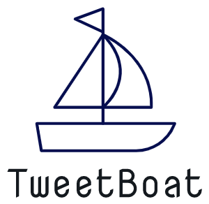
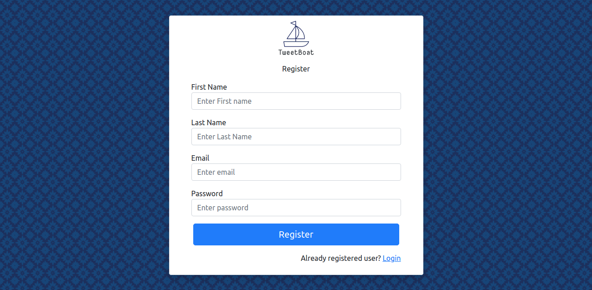
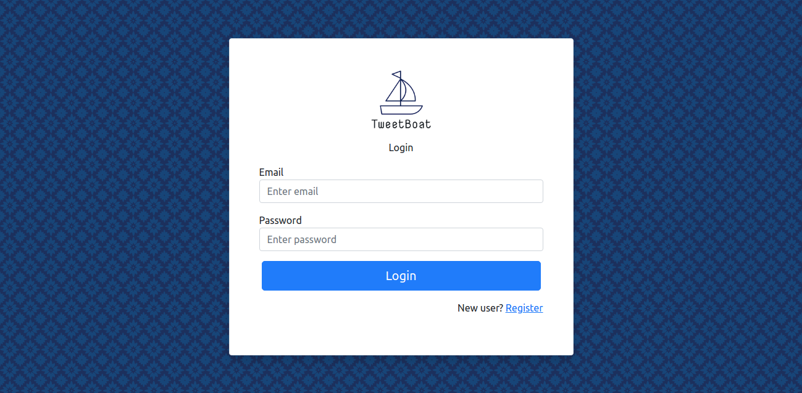
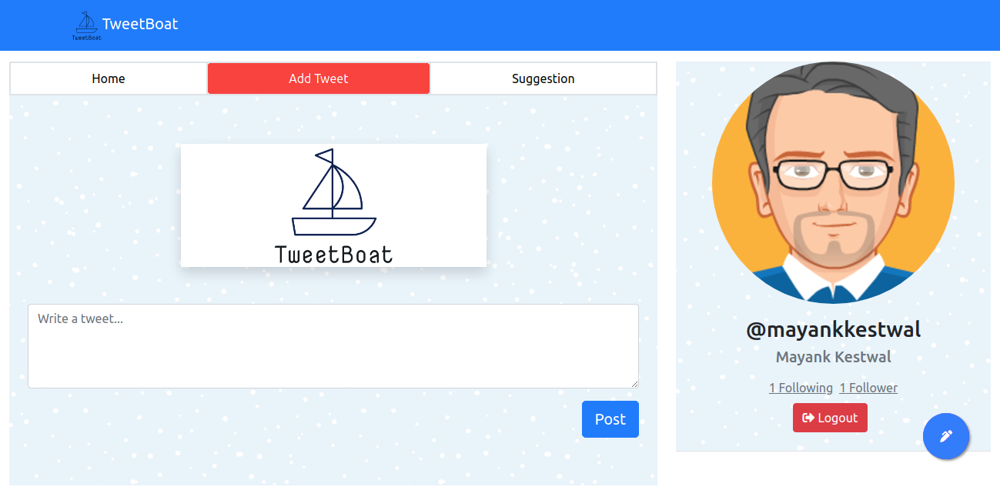
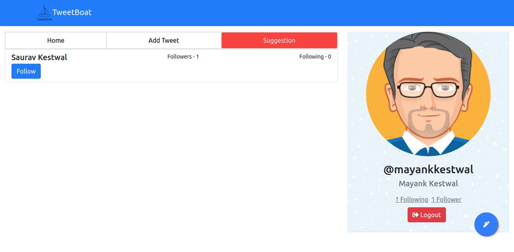
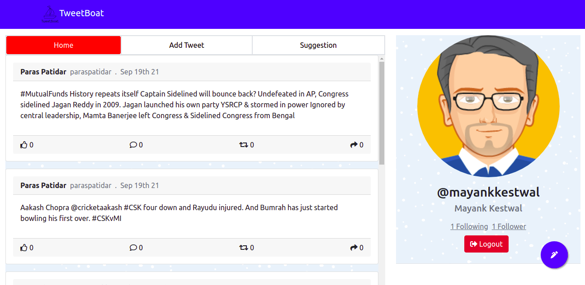

# TweetBoat

TweetBoat is a twitter like application where you can do tweets, and follow people around the world.

[Demo](https://tweetboat.herokuapp.com/)



## Product Features:

1. Signup


2. Login/Logout


3. Post a status update


4. Follow other users


5. View a feed of the status updates of the users you are following


## Requirements

For development, you will only need Node.js and a node global package, Yarn, installed in your environement.

### Node
- #### Node installation on Windows

  Just go on [official Node.js website](https://nodejs.org/) and download the installer.
Also, be sure to have `git` available in your PATH, `npm` might need it (You can find git [here](https://git-scm.com/)).

- #### Node installation on Ubuntu

  You can install nodejs and npm easily with apt install, just run the following commands.

      $ sudo apt install nodejs
      $ sudo apt install npm

- #### Other Operating Systems
  You can find more information about the installation on the [official Node.js website](https://nodejs.org/) and the [official NPM website](https://npmjs.org/).

If the installation was successful, you should be able to run the following command.

    $ node --v

    $ npm --version

If you need to update `npm`, you can make it using `npm`! Cool right? After running the following command, just open again the command line and be happy.

    $ npm install npm -g

## Installation

You need to have node in your system

1. ```git clone https://github.com/Mayankkestwal10/tweetboatclient```

2. ```cd tweetboatclient```

3. ```npm install```

## Dependencies
```
"dependencies": {
    "@testing-library/jest-dom": "^5.11.4",
    "@testing-library/react": "^11.1.0",
    "@testing-library/user-event": "^12.1.10",
    "axios": "^0.21.4",
    "bootstrap": "^5.1.0",
    "moment": "^2.29.1",
    "react": "^17.0.2",
    "react-bootstrap": "^2.0.0-beta.6",
    "react-dom": "^17.0.2",
    "react-infinite-scroll-component": "^6.1.0",
    "react-router-dom": "^5.3.0",
    "react-scripts": "4.0.3",
    "react-toastify": "^8.0.2",
    "web-vitals": "^1.0.1"
  },
```


## License
[MIT](https://choosealicense.com/licenses/mit/)
